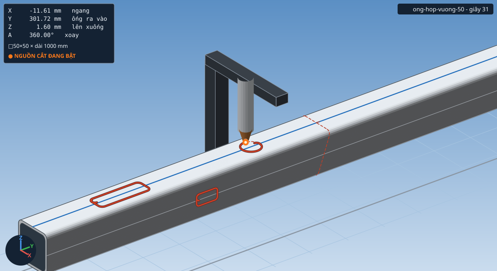
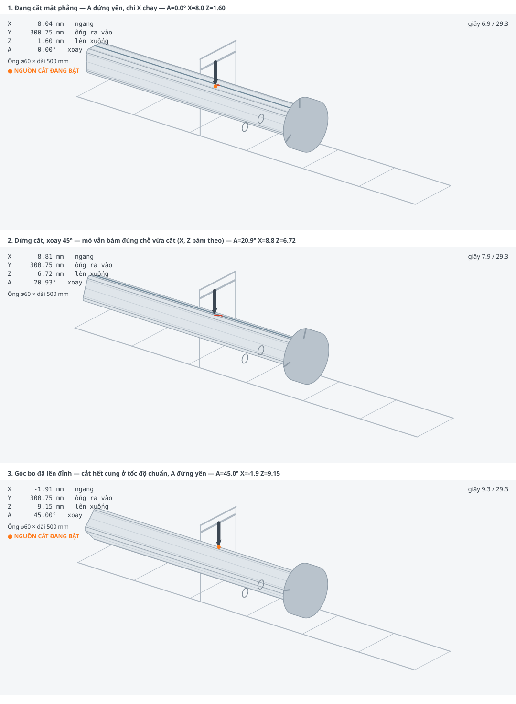
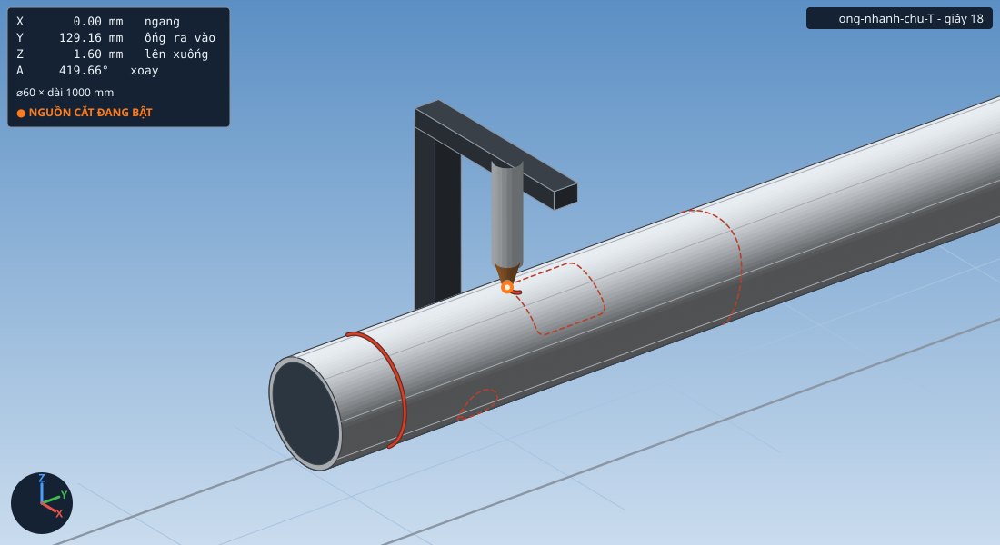

# PipeCut Studio — Phần mềm máy cắt ống 4 trục cho ESP32 / FluidNC

Phần mềm chạy trên máy tính (Windows / Linux / macOS), nói chuyện với bo **ESP32
chạy firmware FluidNC** qua **cổng COM**, để điều khiển máy cắt ống 4 trục:
sinh biên dạng, tính đường chạy dao, xem trước, rồi nạp G-code xuống máy.

Trọng tâm của phần mềm là **đường cắt mượt nhờ bốn trục phối hợp** — xem phần
[Ba trụ cột của độ mượt](#ba-trụ-cột-của-độ-mượt) và
[docs/KY_THUAT.md](docs/KY_THUAT.md).

```
┌──────────────┐   USB / COM   ┌──────────────┐   xung bước   ┌──────────────┐
│ PipeCut      │ ────────────► │ ESP32        │ ────────────► │ Máy cắt ống  │
│ Studio (PC)  │ ◄──────────── │ FluidNC      │               │ X Y Z A      │
└──────────────┘   trạng thái  └──────────────┘               └──────────────┘
```

---

## Máy 4 trục gồm những gì

| Trục | Vai trò | Đơn vị | Ghi chú |
|------|---------|--------|---------|
| **Y** | **ống ra vào** — bàn mang mâm cặp chạy dọc trục ống | mm | phôi tịnh tiến, mỏ cắt đứng yên |
| **A** | **mâm cặp xoay** ống | **độ** | quay vô hạn, không cần về gốc |
| **X** | **mỏ cắt chạy ngang**, vuông góc với trục Y | mm | hoặc dùng làm trục vát mép |
| **Z** | **mỏ cắt lên xuống** | mm | giữ khoảng cách mỏ–phôi |

```
              Z ↕ mỏ cắt lên xuống
              │
        X ↔───┴───  mỏ cắt chạy ngang (vuông góc Y)
              ▼
   ══════════════════════════╗
    ống  ←── Y ──→  quay A   ║ mâm cặp
   ══════════════════════════╝
```

Gốc toạ độ quy ước: **Y0** khi mũi cắt ở đúng mặt đầu phôi, **Z0** khi mũi cắt
chạm mặt ống, **A0** ở vị trí 12 giờ (ngay dưới mỏ cắt), **X0** khi mỏ cắt nằm
đúng trên đường tâm ống.

Vai trò trục khai báo được trong hồ sơ máy, nên nếu máy của bạn là kiểu **xe mỏ
cắt chạy dọc còn ống đứng yên** thì chỉ cần đổi vai trò và đặt
`"layout": "torch_moves"` — phần còn lại của phần mềm không đổi gì.

---

## Phôi: ống tròn và ống hộp

| Loại phôi | Khai báo | Bốn trục phối hợp thế nào |
|---|---|---|
| **Ống tròn** | đường kính ngoài | A quay đều, X đứng yên ở 0, Z giữ nguyên |
| **Ống hộp vuông** | cạnh (+ góc lượn) | trên mặt phẳng: A đứng yên, **X chạy dọc mặt**; qua góc lượn: A xoay 90°, X và Z phối hợp bám cung |
| **Ống hộp chữ nhật** | cạnh ngang + cạnh dọc | như trên, hai cặp mặt khác chiều dài |

Điểm mấu chốt: mỏ cắt **luôn vuông góc với bề mặt phôi**. Phần mềm xoay trục A sao
cho pháp tuyến chỗ đang cắt hướng thẳng lên, dùng trục X đưa mỏ cắt tới đúng vị trí
trên mặt, và trục Z bù chênh cao (góc lượn nhô cao hơn mặt phẳng vài milimét).
Với ống tròn, phép ánh xạ này tự rút gọn về X = 0, Z không đổi — nên cùng một bộ
mã chạy đúng cho cả hai loại phôi.

Góc lượn để 0 thì phần mềm tự lấy 2 lần chiều dày thành (sát ống hộp thật). Góc
nhọn tuyệt đối không cắt được: tại đó pháp tuyến đổi hướng đột ngột 90°, máy sẽ
phải xoay tại chỗ.

### Ba cách vượt qua góc ống hộp

Qua cung góc lượn, mâm cặp phải quay 90° trong đoạn cung rất ngắn — ống 50×50 góc
lượn R6 cần ~15 000 độ/phút để giữ tốc độ cắt 1600 mm/phút, không mâm cặp nào làm
nổi. Ba lối ra, đo trên cùng một nhát cắt đứt ống 50×50×3:

| `corner_mode` | Tốc độ cắt | Dài cắt | Điểm mồi | Thời gian |
|---|---|---|---|---|
| `follow` | 377 – 1600 *(tụt ở góc)* | 194,7 mm *(đủ)* | 1 | 18 s |
| `index` | **1600 đều** | 159,1 mm *(**thiếu 4 cung góc**)* | 5 | 23 s |
| **`pivot`** *(mặc định)* | **1600 đều** | **194,7 mm *(đủ)*** | 9 | 29 s |

* **`follow`** — cắt liền mạch, ba trục bám mặt. Đơn giản nhất, chỉ một điểm mồi,
  nhưng tốc độ tụt còn ~1/4 ở góc (bật `uniform_feed` để đều lại, cả đường cùng chậm).
* **`pivot`** — *cắt hết mặt phẳng → dừng, xoay 45° đưa góc bo lên đỉnh (mỏ vẫn
  đứng đúng chỗ vừa cắt, X và Z bám theo) → cả cung góc giờ nằm quanh đỉnh nên cắt
  hết cung ở **tốc độ chuẩn** với trục A đứng yên → xoay nốt 45° về mặt kế tiếp →
  cắt tiếp*. Vì sao nhanh được: cắt hết cung 9,4 mm chỉ cần trục ngang chạy 8,5 mm,
  trục A không phải quay. Đánh đổi: hai đầu cung mỏ nghiêng tới 45° so với pháp
  tuyến nên mặt cắt chỗ đó không vuông góc, và tốn thêm 2 điểm mồi mỗi góc.
* **`index`** — dừng cắt, tắt mỏ, nhấc lên, xoay hết 90° rồi mồi lại. Nhanh gọn
  nhưng **bốn cung góc không được cắt** nên phôi chưa rời hẳn (phần mềm cảnh báo rõ).
  Đặt `corner_torch_off = false` thì mỏ cháy suốt lúc xoay, khi đó tương đương `follow`.

Một chu kỳ `pivot` trong G-code thật (ống 50×50, góc lượn R6):

```gcode
X19                          ; cắt hết mặt phẳng, A đứng yên
M5                           ; tắt mỏ
X17.324 Z2.789  A3.75        ; xoay 45 độ, mỏ vẫn bám đúng điểm v=19 trên phôi
X13.758 Z4.826  A11.25       ; (X và Z phối hợp giữ mỏ đứng yên tại chỗ đó)
...
X-4.243 Z7.713  A45          ; góc bo đã lên đỉnh
G0 Z9.913 / M3 / G4 / G1 Z7.713   ; mồi lại
X-3.794 Z8.118 F1600         ; CẮT HẾT CUNG GÓC Ở TỐC ĐỘ CHUẨN, A đứng yên
X-2.787 Z8.784
X0.125  Z9.469               ; qua đỉnh cung
X4.243  Z7.713               ; hết cung
M5                           ; tắt mỏ, xoay nốt 45 độ
X2.199  Z7.924  A48.75
...
X-19 A90                     ; về mặt phẳng kế tiếp
G0 Z3.8 / M3 / G4 / G1 Z1.6  ; mồi lại
X-15.642 F1600               ; cắt tiếp
```

Một chu kỳ `index` trong G-code thật:

```gcode
X15.892                      ; đang cắt trên mặt phẳng, A đứng yên
X19                          ; tới mép mặt
M5                           ; tắt mỏ
G4 P0.2
X16.992 Z9.415  A5.774       ; ba trục phối hợp: mâm quay, X và Z giữ mỏ bám góc
X14.812 Z11.019 A11.548
...
X-19    Z7.6    A90          ; quay đủ 90 độ, mỏ vẫn ở đúng góc đó
G0 Z3.8                      ; hạ xuống cao độ mồi
M3 S1000                     ; mồi lại
G4 P0.6
G1 Z1.6 F600                 ; xuống cao độ cắt
X-15.642 F1600               ; cắt tiếp mặt kế bên
```



Ba khoảnh khắc của chế độ `pivot` — cắt mặt phẳng, xoay 45° (mỏ bám đúng chỗ),
rồi cắt hết cung góc ở tốc độ chuẩn:



### Cắt góc gần vuông hơn: chia cung làm nhiều lần xoay

Kiểu `pivot` mặc định xoay **một lần** đưa giữa cung lên đỉnh rồi cắt hết cung
với trục A đứng yên — nhanh, nhưng ở hai đầu cung mỏ nghiêng tới 45° so với
pháp tuyến nên mặt cắt chỗ đó không vuông góc.

Ô **Chia cung góc mấy lần xoay** cho phép đổi lấy độ vuông góc. Đo trên nhát cắt
đứt ống 50×50 góc lượn R6, đặt 1600 mm/phút:

| Chia | Mỏ nghiêng tối đa | Tốc độ cắt | Số lần mồi | Thời gian |
|---|---|---|---|---|
| 1 *(mặc định)* | 45° | 1600 mm/ph | 9 | 29 s |
| 2 | 22,5° | 1600 mm/ph | 13 | 34 s |
| 3 | 15° | 1600 mm/ph | 17 | 38 s |
| 6 | 7,5° | 1600 mm/ph | 29 | 51 s |

Tốc độ cắt **không đổi** dù chia bao nhiêu lần — cái phải trả là **số lần mồi**,
vì mỗi lần xoay là một lần tắt mỏ rồi mồi lại. Mồi là thứ hại phôi và hao vật tư
nhất, nên mặc định để 1; cần mặt cắt vuông hơn thì tăng lên.

Tắt ô *Tắt mỏ khi xoay góc* thì chia bao nhiêu cũng chỉ 1 lần mồi và 21 giây —
đổi lại mỏ dừng tại chỗ với lửa đang cháy, sẽ khoét rộng chỗ đó.

Khe hở mỏ–phôi giữ đúng 1,600 mm ở mọi cách chia.

## Làm được những gì

| Nguyên công | Mô tả |
|---|---|
| `cutoff` | Cắt đứt vuông góc hoặc **cắt vát** một góc bất kỳ (làm co, cút) |
| `saddle` | **Miệng cá / yên ngựa** — cắt đầu ống nhánh ôm khít ống chính (chữ T, chữ Y, lệch tâm) *— chỉ ống tròn* |
| `hole` | **Lỗ xuyên thành ống**, hướng tâm hoặc xiên, có lệch tâm *— chỉ ống tròn* |
| `slot` | Cửa sổ / rãnh chữ nhật bo góc, đo theo kích thước thật trên bề mặt |
| `circle` | Đường tròn đo trên bề mặt ống |
| `helix` | Đường xoắn ốc quanh ống |
| `axial` | Đường cắt hoặc vạch dấu dọc thân ống |
| `ring_mark` | Vạch dấu vòng quanh ống |
| `weld_prep` | Vát mép hàn chữ V ở đầu ống |
| `pattern` | **Nhập biên dạng từ tệp ngoài** — DXF, SVG, G-code phẳng, STL/OBJ, CSV/JSON |

Hỗ trợ tiến trình: **plasma, laser, oxy-gas, phay, bút vạch dấu**.

---

## Nhập biên dạng từ phần mềm khác

Không phải vẽ lại: hình đã có ở đâu thì nạp thẳng từ đó vào.

| Định dạng | Nguồn thường gặp | Phần mềm hiểu như thế nào |
|---|---|---|
| `.dxf` | AutoCAD, LibreCAD, DraftSight, Fusion | Bản vẽ 2D — đọc LINE, CIRCLE, ARC, ELLIPSE, LWPOLYLINE (kể cả cung *bulge*), POLYLINE, SPLINE; lọc được theo lớp |
| `.svg` | Inkscape, Illustrator, Figma, Corel | Hình vector — đọc `path` (đủ M L H V C S Q T A Z), `rect` (kể cả bo góc `rx`/`ry`), `circle`, `ellipse`, `polyline`, `polygon`, `line`, kèm `transform` lồng nhau |
| `.nc` `.gcode` `.tap` `.ngc` | **CAM bất kỳ** — Fusion, SheetCam, Inkscape, LibreCAD | G-code **phẳng hai trục** như cắt tôn tấm: G0/G1/G2/G3, I/J và R, G90/G91, G20/G21 |
| `.stl` `.obj` | SolidWorks, Inventor, Fusion, Blender... | **Mô hình 3D chi tiết đã cắt** — phần mềm tự dò ra đường cắt trên mặt phôi |
| `.csv` `.json` | Bảng tính, mã tự viết | Danh sách điểm `(u, v)` tính bằng mm trên tấm trải phẳng |

Xem thử một tệp trước khi đưa vào công việc:

```bash
python -m pipecut import examples/bien_dang_cua_so.dxf
python -m pipecut import chi_tiet.stl --mesh-tol 0.3
```

Trong giao diện: thẻ **Công việc** → thêm nguyên công `pattern` → nút **Chọn...**.
Phần mềm đọc thử ngay và cho biết trong tệp có mấy đường, dài bao nhiêu.

**Quan trọng:** biên dạng nhập vào đi đúng dây chuyền xử lý của biên dạng tự
sinh — bù bề rộng mạch cắt, vào/ra dao, bo góc, xoay góc ống hộp, bù tốc độ
tổng hợp bốn trục. Nạp vào rồi thì không còn phân biệt "hình tự vẽ" hay "hình
nhập" nữa.

### Nhận mô hình 3D thì phần mềm tự chỉnh những gì

Nạp STL không phải là "chỉ nhận dạng rồi để đấy". Trình tự tự động:

1. **Dò trục phôi** — cạnh dài nhất của khối bao, ghi đè được bằng `--mesh-axis`.
2. **Dò tâm tiết diện** và bù góc xoay quanh trục (`--mesh-roll`).
3. **Tách mặt phôi gốc khỏi mặt cắt mới** bằng khoảng cách có dấu tới tiết diện
   đã khai báo; ranh giới giữa hai phần **chính là đường cắt**.
4. **Trải phẳng** đường đó về toạ độ `(dọc phôi, chu vi)` và gỡ cuộn qua mốc 0.
5. **Soát lại** xem tiết diện khai báo có khớp mô hình không — sai kích thước,
   quên bán kính bo góc hay nhầm đơn vị inch đều bị cảnh báo, chứ không lặng lẽ
   cho ra đường cắt sai.
6. Từ đó trở đi là **đúng dây chuyền chung**: bù kerf, vào/ra dao, chiến lược
   góc, bù tốc độ.

> **STEP và IGES chưa đọc được.** Đó là định dạng B-rep, muốn dựng lại phải kèm
> cả một nhân hình học rất nặng. Mọi phần mềm CAD đều xuất được STL — hãy xuất
> STL với sai số lưới 0,01–0,05 mm rồi nạp vào đây.

---

## Dò cạnh: máy tự tìm phôi và đặt gốc

Không phải rà tay từng trục nữa. Máy tự dò ra **cả bốn gốc**: mặt phôi (Z),
đường tâm phôi (X), mặt đầu ống (Y), và với ống hộp là cả góc xoay cho mặt phẳng
nằm ngang (A).

**Cần thêm gì:** một tiếp điểm đóng khi chạm phôi, nối vào chân `probe` của
FluidNC. Lưu ý cái bán rời gồm bi ruby + trục sứ chỉ là **kim dò** — bi ruby và
trục sứ đều không dẫn điện, phải mua cả **thân đầu dò cảm ứng** thì mới có tiếp
điểm.

**Đầu đảo** — cách đang dùng: đầu dò gắn lệch **90°** với mỏ cắt trên một trục
đảo (trục `B`), một mô-tơ xoay qua lại đổi đầu nào chúc xuống. Cái hay về hình
học: khi mỗi đầu đã chúc xuống thì cả hai nằm **đúng cùng một chỗ theo X-Y**,
chỉ khác chiều cao — nên thường chỉ phải khai một số duy nhất, *đầu dò thấp hơn
mỏ bao nhiêu mm*.

Phần mềm tự lo trình tự: nâng Z → xoay sang đầu dò → dò → xoay về mỏ cắt. Ba
chốt an toàn: **nâng trước rồi mới xoay** (không thì đầu dài quét vào phôi, phần
mềm chặn nếu cao độ xoay quá thấp); **dò lỗi hay bấm dừng vẫn tự trả đầu về mỏ
cắt**; và **mọi chương trình cắt đều mở đầu bằng lệnh đưa đầu đảo về mỏ cắt**,
đứng trước mọi lệnh bật nguồn — mất điện xong máy không biết đầu nào đang chúc
xuống, đoán sai là mồi lửa ngay trên đầu dò.

**Vì sao không dò ngang như máy phay:** mỏ treo thẳng đứng, đâm ngang vào ống là
gãy mỏ. Nên cách làm ở đây chỉ cần **dò xuống**:

```
dò xuống ở chỗ A  ->  chạm   =>  chỗ này còn phôi
dò xuống ở chỗ B  ->  hụt    =>  chỗ này hết phôi
             chia đôi A-B, dò lại, lặp lại  =>  ra đúng mép
```

Từ khoảng tìm 40 mm xuống sai số 0,1 mm chỉ mất 9 lần dò.

**Nó còn tự soát giúp:** lúc tìm tâm, phần mềm đo lại bề rộng phôi rồi đối chiếu
với số đã khai — sai kích thước thì báo, mà phôi bị đặt xoay lệch thì nó nói
luôn lệch khoảng bao nhiêu độ và bảo cân mặt trước.

Thử trước khi có cảm biến (máy ảo có sẵn phôi ảo, đặt lệch và xoay tuỳ ý):

```bash
python -m pipecut probe all --fake-x 7.35 --fake-y 12.4 --fake-roll 6.2
python -m pipecut probe surface --port 192.168.1.50    # với máy thật
```

Chi tiết ở [mục 12 của hướng dẫn](docs/HUONG_DAN.md#12-dò-cạnh-máy-tự-tìm-phôi-và-đặt-gốc).

---

## Giao diện

Hai chế độ hiển thị, đổi bằng nút **◐** ở góc trên bên phải và được ghi nhớ cho
lần mở sau. Tông màu lấy theo **FreeCAD**: khung nhìn nền chuyển sắc xanh lam,
khung điều khiển xám trung tính, điểm nhấn xanh dương; phôi và máy giữ màu kim
loại ở cả hai chế độ.

Màu có nghĩa chứ không phải trang trí: **đỏ cam** là đường cắt, **xanh dương**
là vạch dấu, **xanh lá** là vào/ra dao, **xám nét đứt** là chạy không; nút
**xanh dương** là lệnh làm máy chạy, nút **đỏ** là lệnh nguy hiểm. Mọi cặp
chữ/nền ở cả hai chế độ đều đã soát theo tiêu chuẩn tương phản **WCAG AA**.

Bản vẽ SVG xuất ra theo đúng tông màu đang xem (`--theme light|dark`).

---

## Nạp firmware FluidNC nào cho ESP32

Tải ở https://github.com/bdring/FluidNC/releases — lấy bản gắn nhãn **Latest**,
không lấy bản có chữ `pre` (bản thử nghiệm). Trong tệp nén, chạy theo thứ tự:

```
install-fs      ← lần đầu tiên, nạp WebUI vào flash (chỉ một lần)
install-wifi    ← firmware bản WiFi
```

**Phải là bản `wifi`, không phải `bt`.** ESP32 chỉ có một bộ thu phát vô tuyến
nên không chạy WiFi và Bluetooth cùng lúc; FluidNC vì thế tách thành hai bản
firmware riêng. Nạp bản `bt` là mất chức năng nối qua mạng LAN dưới đây.

### Bo gốc hay bo S3 — nạp khác nhau

Hai dòng chip dùng **firmware khác nhau và bảng chân khác nhau**, nạp lẫn là không chạy:

| Bo | Bản firmware | Tệp cấu hình dùng kèm |
|---|---|---|
| **ESP32-S3** (S3-DevKitC-1...) | `wifi_s3` | [`fluidnc_pipe4axis_s3.yaml`](firmware/fluidnc_pipe4axis_s3.yaml) |
| **ESP32 gốc** (WROOM-32) | `wifi` | [`fluidnc_pipe4axis.yaml`](firmware/fluidnc_pipe4axis.yaml) |

Bo **S3-DevKitC-1 có hai cổng USB-C**: cổng in chữ **USB** nối thẳng vào chip
(hiện ra dưới mã Espressif `303A:1001`, Linux là `/dev/ttyACM*`), cổng **UART**
đi qua CP2102/CH340 (`/dev/ttyUSB*`). Cả hai dùng được; `python -m pipecut ports`
ghi rõ từng loại. Cắm cổng **USB** thì tốc độ baud không có ý nghĩa.

S3 không có bản `bt` vì chip này không có Bluetooth Classic. Muốn biết một tệp
`.bin` đã tải là bản nào: `esptool.py image_info --version 2 firmware.bin` — mã
chương trình nạp ở `0x42000000` là S3, ở `0x400D0000` là ESP32 gốc.

Rồi nạp tệp cấu hình máy: WebUI → **Files** → tải lên tệp YAML tương ứng ở bảng
trên → gõ `$Config/Filename=<tên tệp>.yaml` → khởi động lại → gõ
`$Config/Validate` để chắc không còn dòng nào FluidNC không hiểu.

> **Đối chiếu chân GPIO trước khi cấp điện động lực.** Không phải chân nào cũng
> dùng được, và hai dòng chip khác nhau hẳn.
> Trên **ESP32 gốc**: chân 6–11 nối vào chip nhớ flash, chân 34–39 chỉ vào và
> **không có điện trở treo bên trong**, chân 12 kéo cao là máy không khởi động,
> chân 0/2/5/14/15 dính tới chế độ khởi động hoặc phát xung ngay lúc bật nguồn.
> Trên **ESP32-S3**: chân **22–25 không tồn tại**, chân 26–32 là flash, 33–37 là
> PSRAM octal, 19/20 là USB, 43/44 là UART0.
> **Không bao giờ đặt rơ-le mỏ cắt vào chân dính tới khởi động.** Bảng chân đầy
> đủ ở cuối mỗi tệp YAML và trong
> [mục 2.4](docs/HUONG_DAN.md#24-những-chân-esp32-gốc-không-được-dùng) /
> [2.5](docs/HUONG_DAN.md#25-những-chân-esp32-s3-không-được-dùng) của hướng dẫn.

---

## Kết nối qua WiFi / mạng LAN

Ngoài cổng COM, phần mềm nói chuyện được với ESP32 **qua WiFi trong mạng LAN**
bằng đúng giao thức Telnet mà FluidNC mở sẵn (cổng 23).

Trong FluidNC, bật WiFi và Telnet:

```
$Sta/SSID=ten-wifi-nha-ban
$Sta/Password=mat-khau
$Telnet/Enable=ON
$Telnet/Port=23
$Sta/IPMode=DHCP
```

Rồi trỏ phần mềm tới máy:

```bash
python -m pipecut scan                            # dò cả dải mạng, tìm FluidNC
python -m pipecut send ra.nc --port 192.168.1.50  # nạp qua WiFi
python -m pipecut run cong_viec.json --port fluidnc.local
```

Trong giao diện: ô **Cổng / địa chỉ** gõ thẳng địa chỉ IP được, hoặc bấm
**Dò trong mạng LAN** để phần mềm tự tìm (quét chạy ở luồng riêng nên giao diện
không đứng).

Muốn thử toàn bộ đường truyền mạng mà chưa có bo mạch:

```bash
python -m pipecut sim ra.nc --serve 2323          # máy ảo mở cổng mạng
python -m pipecut send ra.nc --port 127.0.0.1:2323
```

> **Nên dùng dây khi cắt thật.** WiFi tiện cho việc nạp chương trình, theo dõi và
> chỉnh máy; nhưng gặp nhiễu hay mất sóng giữa chừng thì nhát cắt hỏng. Xưởng có
> máy hàn, biến tần, nguồn plasma là môi trường nhiễu nặng.

---

## Cài đặt

Cần **Python 3.9 trở lên**.

```bash
git clone https://github.com/NL-Rino/CNC-on-ESP32.git
cd CNC-on-ESP32
pip install -r requirements.txt      # chỉ cần pyserial
```

* Giao diện đồ hoạ dùng **Tkinter**, có sẵn trong bản Python cài trên Windows/macOS.
  Trên Linux: `sudo apt install python3-tk`.
* Phần sinh G-code và mô phỏng **không cần thư viện ngoài nào** — chạy được ngay
  bằng Python thuần.

---

## Bắt đầu nhanh (chưa cần phần cứng)

Phần mềm có sẵn **máy ảo FluidNC**, hãy thử trước khi cắm máy thật:

```bash
python -m pipecut ui                       # mở giao diện, chọn cổng "GIA-LAP"
```

Hoặc bằng dòng lệnh:

```bash
python -m pipecut ops                      # xem danh mục nguyên công
python -m pipecut gen examples/vi_du_ong_T.json -o ong_T.nc --svg xem.svg
python -m pipecut gen examples/vi_du_ong_T.json -o ong_T.nc \
       --machine-svg mo-phong.svg --at 75   # chụp mô phỏng ở 75% chương trình
python -m pipecut sim ong_T.nc --speed 20   # chạy thử trên máy ảo
```

Khi đã có máy thật:

```bash
python -m pipecut ports                    # tìm cổng COM của ESP32
python -m pipecut scan                     # hoặc dò ESP32 trong mạng WiFi/LAN
python -m pipecut run examples/vi_du_ong_T.json --port COM5
python -m pipecut run examples/vi_du_ong_T.json --port 192.168.1.50
```

Trên Windows có thể nháy đúp `chay_gui.py` để mở giao diện.

---

## Trình tự làm việc trên giao diện

```
1. Máy & Kết nối → 2. Điều khiển → 3. Công việc → 4. Xem trước → 5. Mô phỏng → 6. Chạy
   chọn cổng COM    jog, đặt gốc    thêm nguyên    kiểm tra       xem máy       nạp lệnh,
   khai báo phôi    toạ độ          công, nhập số  hình 2D/3D     chạy thử      theo dõi
```

* **Thứ tự cắt giữ đúng như bảng nguyên công.** Phần mềm không tự đổi; muốn nó
  tự xếp (vạch dấu → lỗ/rãnh → cắt đứt từ ngoài vào) thì tích ô *Tự sắp xếp thứ
  tự cắt*. Dòng chữ dưới bảng luôn hiện thứ tự thật sự sẽ chạy.
* **Thư viện nguyên công lọc theo dạng phôi** — khai báo ống hộp thì không hiện
  *miệng cá* và *lỗ xuyên thành* (chỉ có nghĩa với ống tròn).
* **Chọn chỗ vết mồi rơi vào**: *Vị trí điểm mồi* (% chu vi biên dạng) xoay điểm
  bắt đầu quanh đường cắt, *Phía vào dao* chọn vào từ trong hay ngoài (biên dạng
  kín) / lệch về đầu tự do hay về mâm cặp (nhát cắt quanh phôi).
* **Xem trước** có hai khung nhìn: *trải phẳng* (đo kích thước thật) và *ba chiều*
  (hình dung nhát cắt), zoom bằng con lăn, kéo bằng chuột trái.
  Xem bản mẫu: [docs/vi_du_ong_T.svg](docs/vi_du_ong_T.svg).


* **Mô phỏng** dựng lại đúng máy của bạn: đoạn ống dài theo kích thước đã nhập,
  **trượt ra vào** theo trục Y và **quay** theo trục A, mỏ cắt chạy ngang (X) và
  lên xuống (Z), vết cắt đỏ hiện dần trên mặt ống. Chạy được offline — bấm ▶,
  tua tới lui bằng thanh trượt, đổi tốc độ 0,25× đến 20×, kéo chuột để xoay góc
  nhìn. Khi đã nối máy thật, bật *Bám theo máy thật* thì khung này phản chiếu
  đúng vị trí máy đang báo về.
* Trong lúc chạy, vị trí mũi cắt được vẽ **theo thời gian thực** lên bản xem trước,
  dòng G-code đang chạy được tô sáng.
* Nút **DỪNG** gửi feed-hold rồi reset mềm, tắt nguồn cắt ngay lập tức.

---

## Ba trụ cột của độ mượt

Máy cắt ống tự chế hay bị "cắt lúc cháy lúc non, đường cắt gợn sóng". Nguyên nhân
gần như luôn là ba thứ dưới đây, và phần mềm này xử lý cả ba:

### 1. Bù tốc độ tổng hợp cho trục xoay

FluidNC (như Grbl) tính `F` trên **quãng đường tổng hợp trong không gian trục**,
trong đó *độ* của trục A được cộng chung với *mm* của trục X. Ghi `F1600` cố định
thì đoạn chỉ xoay chạy ở 1600 độ/phút — với ống ⌀60 chỉ tương đương **838 mm/phút**
trên bề mặt, chậm hơn 48% so với đoạn chỉ chạy dọc.

Phần mềm tính lại F cho **từng đoạn**:

```
F = v_cắt × L_trục / L_bề_mặt
```

nên tốc độ mũi cắt trên bề mặt ống **luôn không đổi** dù bốn trục phối hợp theo
tỉ lệ nào. Đây là điều kiện đầu tiên để mạch cắt đều.

### 2. Mật độ điểm vừa đủ cho ESP32

Quá nhiều điểm → ESP32 nghẽn, planner hụt hơi, máy giật. Quá ít điểm → đường cong
thành đa giác. Phần mềm rời rạc hoá **thích nghi theo dung sai dây cung**, rồi rút
gọn (Douglas–Peucker), gộp đoạn quá ngắn, chia nhỏ đoạn quá dài. Kết quả: chỗ cong
gắt thì dày điểm, chỗ gần thẳng thì thưa.

### 3. Nạp lệnh theo kiểu đếm ký tự

Không gửi–chờ–`ok` từng dòng (kiểu đó planner không bao giờ nhìn được về phía
trước). Phần mềm luôn giữ bộ đệm nhận của ESP32 **gần đầy** (đo được ~124/127 byte),
để FluidNC lúc nào cũng có 15–30 block phía trước mà làm mượt vận tốc giữa các đoạn.

Ngoài ra: đường cắt được xử lý trên **bề mặt trải phẳng** — một phép đẳng cự, nên
bù kerf, bo góc và đo chiều dài đều chính xác tuyệt đối; và góc quay biến thiên liên
tục, không bao giờ nhảy ±360°.

Riêng với ống hộp có một giới hạn cơ khí không thể tránh: qua góc lượn, trục A phải
quay 90° trong một đoạn cung rất ngắn (ống 50×50 góc lượn R6 cần tới ~15 000 độ/phút
để giữ tốc độ cắt 1600 mm/phút). Phần mềm **kẹp tốc độ theo khả năng thật của trục
và cảnh báo** thay vì xuất ra lệnh máy không chạy nổi. Bật *tốc độ đều*
(`uniform_feed`) để cả đường chạy ở một tốc độ bề mặt duy nhất — chậm hơn nhưng vết
cắt đồng đều từ mặt phẳng sang góc lượn.

---

## Cấu trúc mã nguồn

```
pipecut/
  config.py      hồ sơ máy: trục, phôi, tiến trình, tham số chuyển động
  geom2d.py      hình học 2D: bù đường, bo góc, rút gọn, lấy mẫu thích nghi
  shapes.py      thư viện biên dạng cắt ống (toán giao tuyến mặt trụ)
  toolpath.py    cấu trúc dữ liệu đường chạy dao
  pathops.py     kerf → vào/ra dao → điều tiết điểm → góc trục vát
  kinematics.py  động học 4 trục + bù tốc độ tổng hợp
  gcode.py       hậu xử lý FluidNC (modal, dòng lệnh ngắn)
  section.py     tiết diện phôi: ống tròn, ống hộp vuông, ống hộp chữ nhật
  gsim.py        diễn giải G-code theo thời gian (cho tab Mô phỏng)
  machinescene.py dựng hình mô phỏng máy (dùng chung cho giao diện và SVG)
  jobs.py        mô tả công việc bằng JSON + danh mục nguyên công
  protocol.py    phân tích phản hồi Grbl/FluidNC, mã lỗi tiếng Việt
  probing.py     chế độ dò cạnh: tự tìm phôi rồi đặt gốc toạ độ
  transport.py   cổng COM (pyserial), mạng LAN/WiFi (Telnet) hoặc máy ảo
  importers/     nhập biên dạng: DXF, SVG, G-code phẳng, STL/OBJ, CSV/JSON
  simulator.py   máy ảo FluidNC để thử khi chưa có phần cứng
  controller.py  nạp lệnh đếm ký tự, jog, tạm dừng, dừng khẩn
  svgview.py     xuất bản vẽ xem trước SVG
  cli.py         giao diện dòng lệnh
  palette.py     bảng màu dùng chung (nền sáng / nền tối, tông FreeCAD)
  ui/            giao diện đồ hoạ Tkinter (kèm khung mô phỏng máy 3D)
config/          hồ sơ máy mẫu (ống tròn, ống hộp, xoay góc, trục vát,
                 laser, và bản ESP32-S3 có đầu đảo dò)
firmware/        cấu hình FluidNC cho ESP32 gốc và ESP32-S3
examples/        tệp công việc mẫu + bản vẽ mẫu (DXF, SVG, G-code phẳng)
docs/            hướng dẫn sử dụng và tài liệu kỹ thuật
tests/           230 bài kiểm thử (chạy bằng thư viện chuẩn)
```

Chạy kiểm thử:

```bash
python -m unittest discover -s tests -t .
```

---

## An toàn

Máy cắt ống dùng plasma/laser/oxy-gas là thiết bị nguy hiểm. Phần mềm chỉ là một
lớp điều khiển — **trách nhiệm an toàn thuộc về người vận hành**:

* Luôn thử trên **máy ảo** hoặc chạy khô (tắt nguồn cắt, nâng Z lên cao) trước.
* Kiểm tra `Giới hạn trục` mà phần mềm báo sau khi sinh G-code.
* Lắp công tắc dừng khẩn cấp **cứng**, cắt trực tiếp nguồn động lực — không phụ
  thuộc vào nút DỪNG trên phần mềm.
* Kẹp phôi chắc chắn; ống dài phải có giá đỡ đầu kia của mâm cặp.
* Hút khói, kính bảo hộ đúng cấp, và nối đất thân máy khi cắt plasma.

---

## Tài liệu

* [docs/HUONG_DAN.md](docs/HUONG_DAN.md) — hướng dẫn lắp đặt, hiệu chỉnh và sử dụng.
* [docs/KY_THUAT.md](docs/KY_THUAT.md) — công thức hình học, thuật toán, giao thức.
* [firmware/fluidnc_pipe4axis.yaml](firmware/fluidnc_pipe4axis.yaml) — cấu hình FluidNC mẫu.
* [CHANGELOG.md](CHANGELOG.md) — nhật ký thay đổi theo từng bản phát hành.
